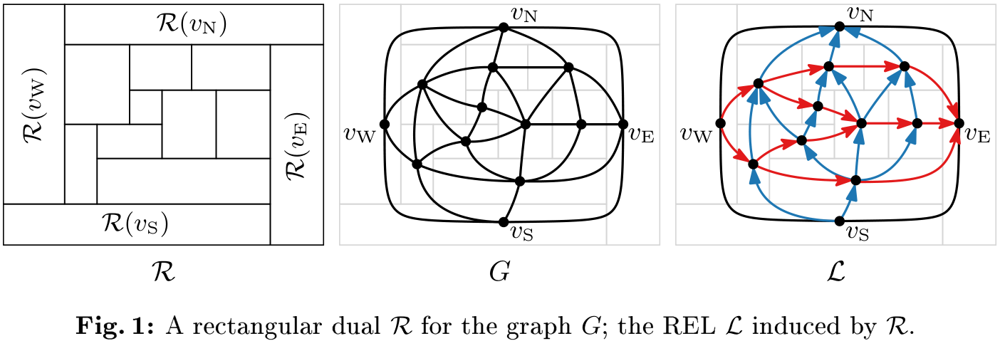
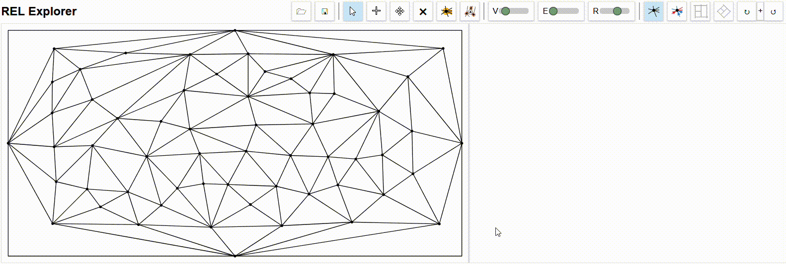

# Rectangular Dual and REL Explorer
Little web tool that I built to explore the space of *rectangular duals* and *regular edge labelings (RELs)* for research purposes and to visualise morphs.

A *rectangular dual* is a contact representation of a planar graph G that is internally triangulated, bounded by a four-cycle, and contains no separating triangle (triangle with vertices both in its interior and exterior); such a graph is called a PTP graph.
A *regular edge labeling (REL)* is a coloring and orientation of G such that and each of the four outer vertices the incident inner edges are blue outgoing, red outgoing, blue incoming, and red incoming (in cw order) and for each inner vertex, the incident edges form four clockwise ordered non-empty blocks of blue incoming, red incoming, blue outgoing, and red outgoing edges. 
With a blue (red) edge representing a horizontal (vertical) contact of two retangles, each REL can be realized by (combinatorically equivalent) rectangular duals and each rectangular dual induces a REL.

For a given PTP graph G, all possible RELs span a *distributive lattice*. By *flipping* four-cycles, we can traverse this lattice of RELs. In the tool, these flips are visualised with morphs.

## Access
You can access the tool [HERE](https://www1.pub.informatik.uni-wuerzburg.de/pub/klawitter/projects/rectangles/page.html).

Alternatively, you can clone the repo and start the [page.html](page.html) with a local server.

## Usage
All symbols in the toolbar have description text on hover. Beyond that, here are only a few comments on the usage:
- Subtoolbars are load/save, tools, change sizes, views, jumping to extremal RELs, examples used in talk on morphing rectangular duals.
- You may load a graph (example or saved graph) or build one yourself. When building a graph, you can check if your graph is PTP graph and a corresponding rectangular dual can thus be constructed.
- You can enable showing different views (third subtoolbar). This includes shwoing all four-cycles (either cw, ccw or both) in the graph.
- With four-cycles enabled, you can click on a four-cycle to flip the REL. The corresponding rectangular dual is also changed and (if enabled) the morph is shown (sometimes with bugs).
 

## Related papers
**Simple algorithms for partial and simultaneous rectangular duals with given contact orientations** 
*Steven Chaplick, Stefan Felsner, Philipp Kindermann, Jonathan Klawitter, Ignaz Rutter & Alexander Wolff* 
[doi: 10.1016/j.tcs.2022.03.031](https://www.doi.org/10.1016/j.tcs.2022.03.031), [arXiv](https://arxiv.org/abs/2102.02013)

**Morphing Rectangular Duals** 
*Steven Chaplick, Philipp Kindermann, Jonathan Klawitter, Ignaz Rutter & Alexander Wolff* 
[doi: 10.1007/978-3-031-22203-0_28](https://www.doi.org/10.1007/978-3-031-22203-0_28), [arXiv](https://arxiv.org/abs/2112.03040)
